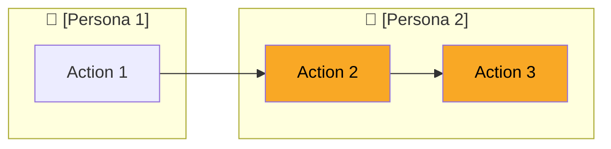

# Spec : [Nom du touchpoint]

[INSTRUCTIONS: Ce fichier est destiné à un PO non-technique. Aucun détail technique (classes, SQL, chemins fichiers, noms de variables). Uniquement du fonctionnel. Ce fichier doit inclure toutes les décisions résolues pendant la phase grill-me avec le PO. ]

## Pourquoi

[1-2 phrases : Quel est l'objectif de cette page ? Quel problème résout-elle pour l'utilisateur ?]



[Diagramme Mermaid `graph LR` montrant le processus global.
Chaque subgraph = une persona (avec emoji 🧑). Chaque nœud = une action.
Mettre en évidence les étapes couvertes par cette page avec `style X fill:#f9a825,color:#000`.
Max 5 colonnes.]

### Démo [PAGE uniquement]

[Inclure le screenshot capturé via agent-browser. Omettre cette section pour les touchpoints non-PAGE.]


---

## Cas d'utilisation

[Chaque cas d'utilisation = un objectif utilisateur cohérent sur cette page.
Pas de détail technique. Décrire ce que l'utilisateur voit et fait.
Mentionner les permissions requises si applicable.
Mentionner les variations par marque avec ⚠️ si applicable.]

### UC1 : [Nom de l'objectif utilisateur]

- **Contexte** : [Depuis où et pourquoi l'utilisateur arrive ici]
- **Étapes** :
  1. [Lister ce que l'utilisateur voit / fait]
  2. [...]
  3. Résultat : [Résultat visible pour l'utilisateur]
- **Cas d'erreur** :
  - [Condition] → [Message ou comportement visible]

### UC2 : [Nom]

- **Contexte** : [...]
- **Étapes** :
  1. [...]
- **Cas d'erreur** :
  - [...]

---

## Précisions (issues du grill-me)

[Toute décision résolue avec le PO pendant le grill-me qui n'apparaissent .

Omettre cette section si tout est déjà couvert par les UC.]

- **[Sujet]** : [Énoncé fonctionnel]
- **[Sujet]** : [...]

---

## Touchpoints

[PAGE : Table exhaustive de TOUS les touchpoints accessibles depuis la page.
✅ = dans le périmètre (déclenché depuis cette page et effectue un traitement métier ou charge des données, même s'il redirige ailleurs après).
❌ = hors périmètre (simple lien de navigation vers une autre page, sans traitement).
Si un touchpoint n'est pas trouvé dans le graph de dépendances, ajouter « ⚠️ pas dans le graph de dépendances » dans la colonne Description.

Non-PAGE : Un seul touchpoint, pas de table. Simplement indiquer le touchpoint analysé.]

| Touchpoint | Description | Périmètre |
|------------|-------------|-----------|
| ✅ POST `/module/action` | [Ce que fait l'action] | Action sur la page |
| ❌ GET `/autre/page` | [Où ça mène] | Lien vers autre page |

---

## Scénarios de validation

[Scénarios précis que le testeur suivra pour valider le touchpoint.
Syntaxe Cucumber avec mots-clés français.
**Couverture 100% obligatoire** : chaque chemin de la logique métier de chaque touchpoint ✅ doit être couvert.
Pour chaque touchpoint ✅, écrire au minimum :
- 1 scénario nominal (happy path)
- 1 scénario par cas d'erreur identifié dans l'analyse (validation, entité non trouvée, etc.)
- 1 scénario par permission (`isAllowed()`) qui masque ou bloque une fonctionnalité
- 1 scénario par cas limite (liste vide, pagination, processus déjà en cours, etc.)
Ne pas écrire de scénarios pour les touchpoints ❌.]

```gherkin
Fonctionnalité: [Nom de la page]

  Scénario: [Nom du scénario nominal]
    Etant donné que [précondition]
    Quand [action utilisateur]
    Alors [résultat attendu]

  Scénario: [Nom du scénario d'erreur]
    Etant donné que [précondition]
    Quand [action utilisateur avec données invalides]
    Alors [message d'erreur ou comportement attendu]

  Scénario: [Nom du scénario de permission]
    Etant donné que un utilisateur sans la permission "[permission]"
    Quand il accède à la page
    Alors [comportement attendu]
```
