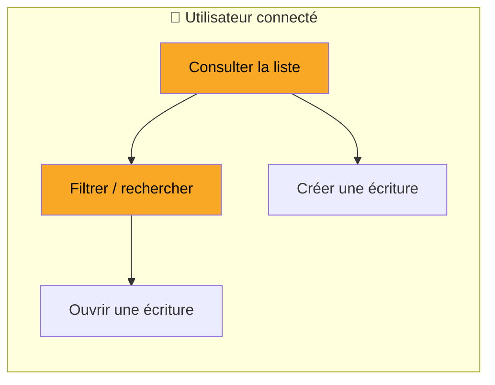
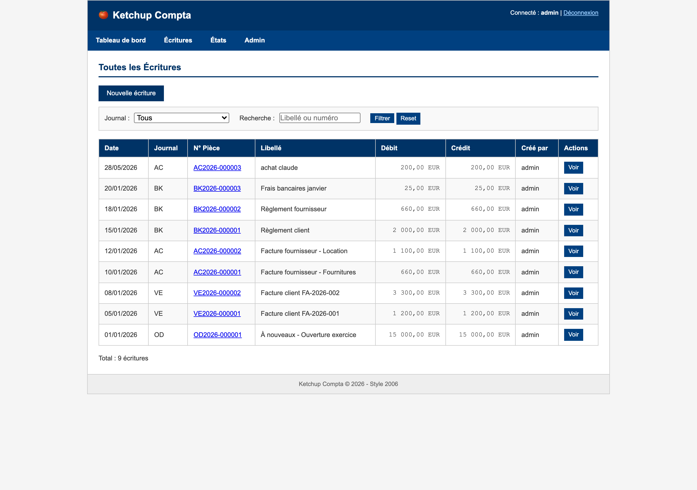

# Spec : Toutes les Écritures

## Pourquoi

Permettre à un utilisateur de la comptabilité de **retrouver et consulter rapidement une écriture**
parmi toutes celles déjà passées, en filtrant par journal ou par recherche texte, et d'accéder à son
détail ou à la création d'une nouvelle écriture.



### Démo



---

## Cas d'utilisation

### UC1 : Consulter et retrouver une écriture

- **Contexte** : un utilisateur connecté arrive sur « Toutes les Écritures » (menu Écritures) pour
  retrouver une écriture précise.
- **Étapes** :
  1. Il voit la liste des écritures, **triée de la plus récente à la plus ancienne**, 30 par page.
  2. Chaque ligne affiche : date (jj/mm/aaaa), journal, n° de pièce, libellé, débit, crédit, créateur.
  3. Il peut filtrer par **journal** (menu déroulant, défaut « Tous ») et/ou saisir une **recherche**
     (sur le libellé ou le numéro de pièce), puis cliquer « Filtrer » ; « Reset » réinitialise.
  4. Il navigue entre les pages si le total dépasse 30 écritures.
  5. Résultat : la liste filtrée s'affiche, avec le total d'écritures correspondant.
- **Cas d'erreur** :
  - Aucune écriture ne correspond → message « Aucune écriture trouvée. » et « Total : 0 écritures ».
  - Utilisateur non connecté → redirection vers la connexion (« Veuillez vous connecter. »).

### UC2 : Rebondir vers le détail ou la création

- **Contexte** : depuis la liste, l'utilisateur veut ouvrir une écriture ou en créer une nouvelle.
- **Étapes** :
  1. Il clique sur le n° de pièce ou « Voir » d'une ligne → ouverture du détail de l'écriture.
  2. Il clique « Nouvelle écriture » → écran de création.

---

## Précisions (issues du grill-me)

- **Périmètre** : la page couvre la consultation, le filtrage et la pagination. Les liens « Nouvelle
  écriture », « Voir » et n° de pièce sont de la **navigation** vers l'écran d'édition (hors périmètre).
- **Recherche** : porte sur le **libellé OU le numéro de pièce** (correspondance sur une sous-chaîne du texte saisi).
- **Filtre journal** : seuls les **journaux actifs** sont proposés ; valeur par défaut « Tous ».
- **Tri** : **non configurable** — date décroissante, puis ordre de saisie décroissant.
- **Pagination** : **30 écritures par page** ; une page demandée hors bornes est ramenée dans
  l'intervalle valide.
- **Accès** : **tout utilisateur connecté** voit la liste, accède au détail et au bouton « Nouvelle
  écriture » — sans distinction. *(Comportement legacy reproduit à l'identique.)*

### Décisions produit (hors legacy)

> ⚠️ Ces points **n'existent pas** dans l'application legacy. Ils sont notés comme décisions produit à
> planifier **séparément** de la migration iso-fonctionnelle — ils ne sont pas des scénarios de validation
> de la migration.

- **Permissions par rôle** : le legacy n'a **aucune notion de rôle** (tous les utilisateurs connectés ont
  les mêmes droits). L'introduction de rôles (ex. masquer « Nouvelle écriture » à un profil lecture seule)
  est une **évolution produit** à traiter hors de cette migration.

---

## Touchpoints

| Touchpoint | Description | Périmètre |
|------------|-------------|-----------|
| ✅ GET `/modules/entries/list.php` | Liste des écritures : filtre journal, recherche, pagination, affichage | Page consultée |
| ❌ GET `/modules/entries/edit.php` | Création d'une écriture (« Nouvelle écriture ») | Lien vers autre page |
| ❌ GET `/modules/entries/edit.php?id={id}` | Détail d'une écriture (« Voir » / n° de pièce) | Lien vers autre page |

---

## Points d'entrée

Par où l'utilisateur arrive sur cette page (cf. navigation legacy) :

| Origine | Type | Contexte |
|---------|------|----------|
| Menu « Toutes les écritures » | menu | Barre de navigation principale |
| Écran d'édition — écriture introuvable | redirection | Ouverture d'une écriture par identifiant inexistant → retour liste avec « Pièce introuvable. » |
| Écran d'édition — « Retour à la liste » | bouton | Retour depuis le détail/édition |
| Écran d'édition — « Annuler » | bouton | Abandon de l'édition |

---

## Scénarios de validation

```gherkin
Fonctionnalité: Toutes les Écritures

  Scénario: Afficher la liste par défaut
    Etant donné que je suis connecté et qu'il existe des écritures
    Quand j'ouvre la page "Toutes les Écritures"
    Alors je vois les écritures triées de la plus récente à la plus ancienne
    Et je vois au maximum 30 écritures
    Et je vois le total d'écritures

  Scénario: Filtrer par journal
    Etant donné que je suis sur la liste des écritures
    Quand je sélectionne un journal et que je clique "Filtrer"
    Alors je ne vois que les écritures de ce journal

  Scénario: Rechercher par libellé
    Etant donné que je suis sur la liste des écritures
    Quand je saisis un libellé dans la recherche et que je clique "Filtrer"
    Alors je ne vois que les écritures dont le libellé contient ce texte

  Scénario: Rechercher par numéro de pièce
    Etant donné que je suis sur la liste des écritures
    Quand je saisis un numéro de pièce dans la recherche et que je clique "Filtrer"
    Alors je ne vois que les écritures dont le numéro de pièce contient ce texte

  Scénario: Recherche sans résultat
    Etant donné que je suis sur la liste des écritures
    Quand je filtre avec un critère qui ne correspond à aucune écriture
    Alors je vois le message "Aucune écriture trouvée."
    Et je vois "Total : 0 écritures"

  Scénario: Filtre journal invalide
    Etant donné que je suis sur la liste des écritures
    Quand j'ouvre la liste avec un journal invalide (non numérique)
    Alors aucune écriture n'est affichée
    Et je vois le message "Aucune écriture trouvée."

  Scénario: Liste vide
    Etant donné que je suis connecté et qu'il n'existe aucune écriture
    Quand j'ouvre la page "Toutes les Écritures"
    Alors je vois le message "Aucune écriture trouvée."

  Scénario: Naviguer entre les pages
    Etant donné qu'il existe plus de 30 écritures
    Quand je clique sur la page suivante
    Alors je vois les écritures suivantes triées de la plus récente à la plus ancienne

  Scénario: Page hors bornes
    Etant donné qu'il existe des écritures sur 2 pages
    Quand je demande une page au-delà de la dernière
    Alors je suis ramené à la dernière page valide

  Scénario: Arrivée depuis une écriture introuvable
    Etant donné que je suis connecté
    Quand j'ouvre une écriture dont l'identifiant n'existe pas
    Alors je suis redirigé vers la liste des écritures
    Et je vois le message "Pièce introuvable."

  Scénario: Accès sans connexion
    Etant donné que je ne suis pas connecté
    Quand j'essaie d'ouvrir la page "Toutes les Écritures"
    Alors je suis redirigé vers la page de connexion
    Et je vois le message "Veuillez vous connecter."
```
